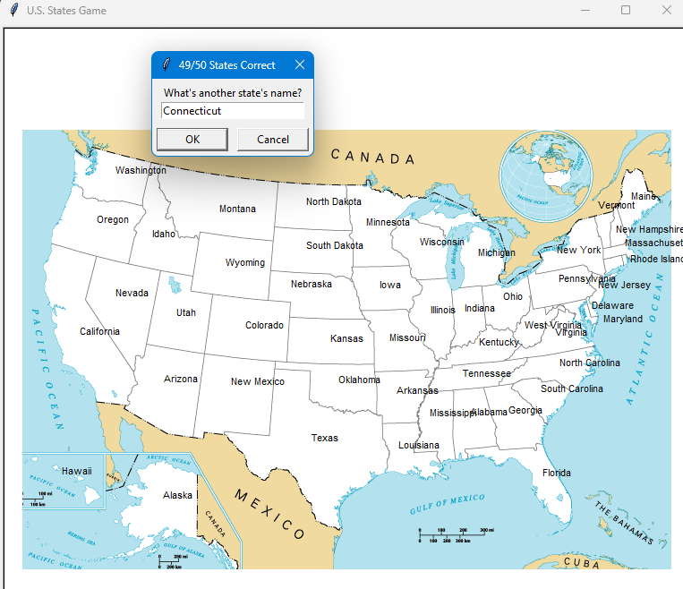

# US States guessing 

## part of 100 days of Python bootcamp, day 25

### graphics based on turtle graphics module

## To play:
- you need to have python 3 installed on your machine
- download the repository
- open terminal in the us-states-game folder and run
  `python main.py`
- once you provide correct state name, it appears on the map
- if you run out of guesses, type "Exit", the game will end and the names of the missed states will be saved in 'states_to_learn.csv' file
